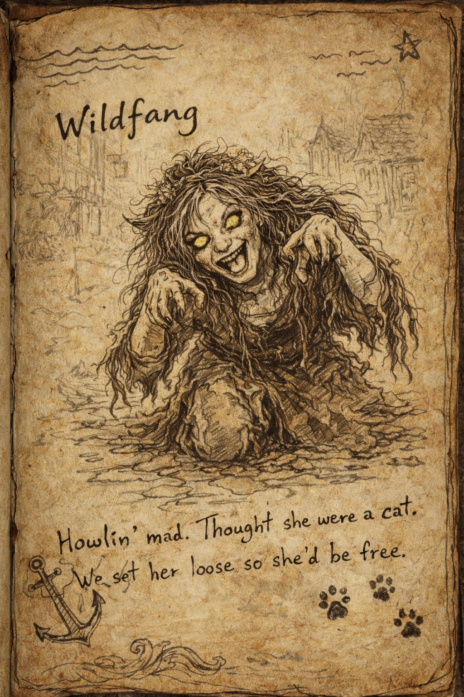

# Druidic Agression

On our way to the Wizard of Wines Winery, we took a shortcut through the woods. 
However the path was trapped and I fell into ino a pit with spikes at the bottom. 
That hurt!
When we got outside we found the footsteps, that seemingly belonged to some druids. 
I yelled out in druidic in the hopes of new allies, however they were not the frendly sort, and attacked us. 
I'm guessing they served Strahd. 
We killed all ten of them, and found one was carrying an image of a staff. 
To me, even the picture seemed to emenate evil. 

When we continued towards the winery we discovered the corpse of the poor catgirl in a ditch on the side of the road. 
She had a drawing of Vichtor with a heart around it. 
Rest in peace catgirl, we will remember you. 

# Abandoned Barn 

We spent the night in an abandoned barn. We do not know if Strahd is still after us, now that Irena stayed behind at the church in Valaki, but better to be on the safe side. During the night, Brie and I had the same dream. Of a city in flames, and Irena mumbling in her sleep "not here, I can't take this again". 
M'huuren tasted the "Mother's Milk" that Brie had been carrying since Bonegrinder Mill. 
He became suddenly very peaceful and felt safe, like he was on vacation, and not trapped in a nightmare of mist and fireballs. 

# Family buisness

When the winery was in sight in the distance we were beckoned to the edge of the forest, where the family that owns the Winery were hiding. 
They looked battered as if they'd been through a fight. 
Damian Martikov told us druids had captured the winery. 
Appearantly the innkeeper that sent us on this quest is his son. 
They do not seem to get along. 

We learned that this is the only place that grapes can grow in all of Barovia, and it's thanks to a wizard that it can grow here. 

# The battle for the Winery

When approaching the winery, a myriad of twig-creatures emerged from the forest around us. 
Istead of fighting, we ran into the winery, and bolted the door behind us. 
However, we might have found where the twig-blights came from. 
Up from a wine-barrel escaped 24 twig-blights. 
And on the balcony above were another druid. 
We defeated all of them in battle. 
Brie found a potion, that none of us coud identify, and M'huuren tried some wine (which didn't look like a good decicion). 