# Combat

<!--

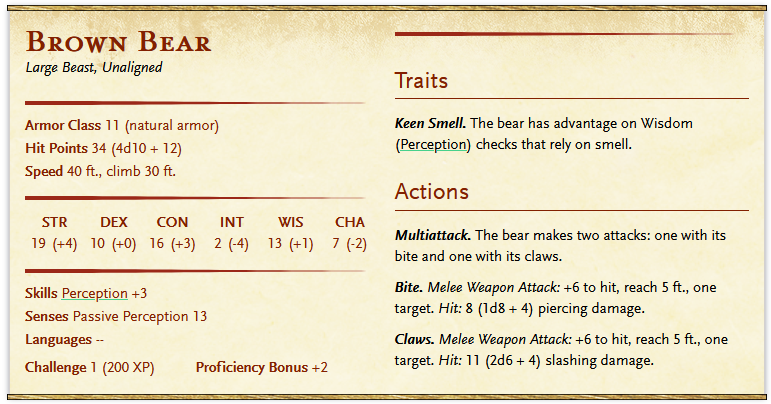

-->

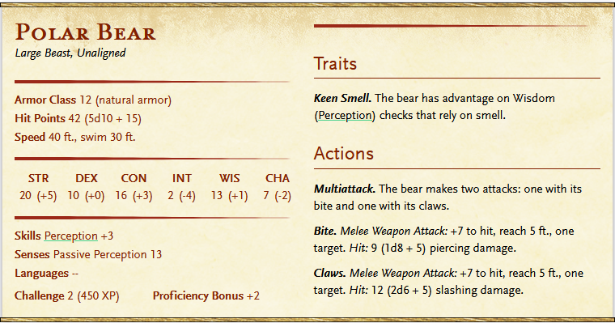

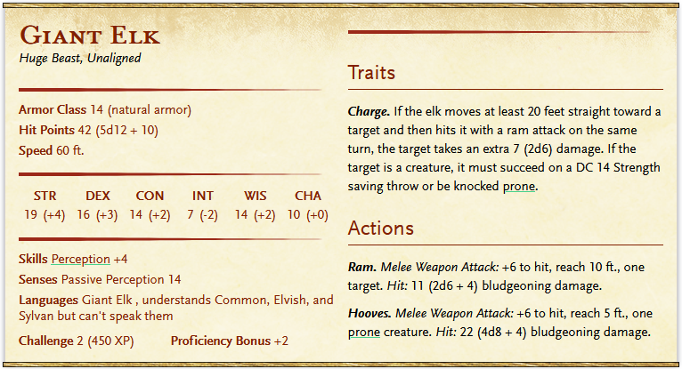

Note: Variant Cave Bear: Darkvision 60ft, otherwise the same

# Tactical

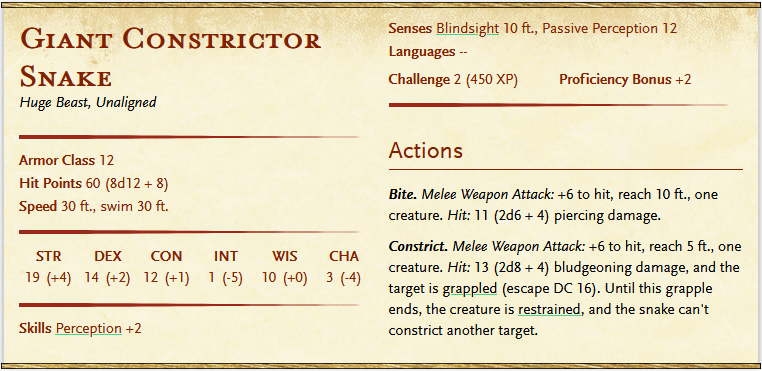

Note: Swim speed (lvl 4)

# Scouting

# Water (lvl 4)

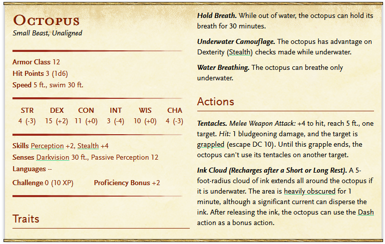
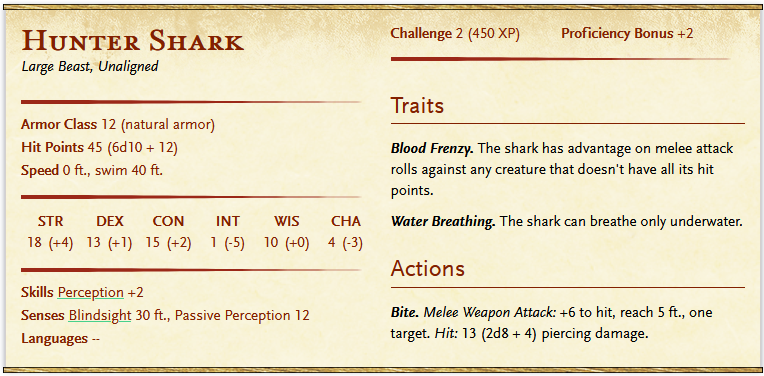

# Flying (lvl 6)

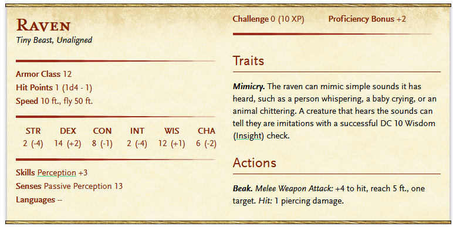
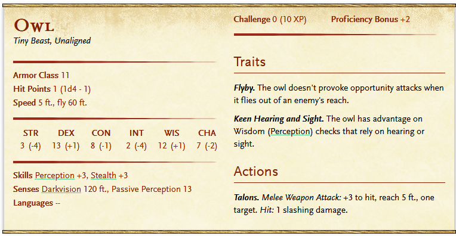
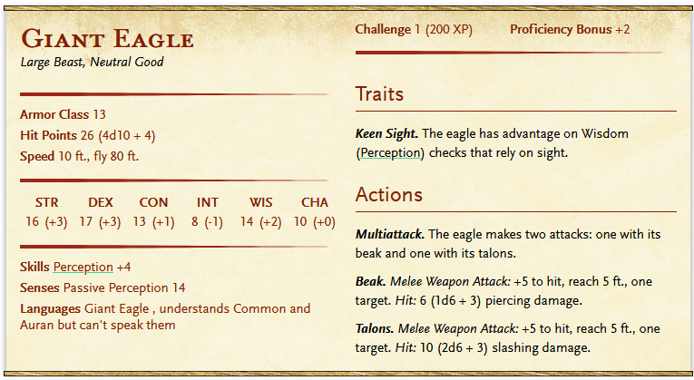

# Climbing 
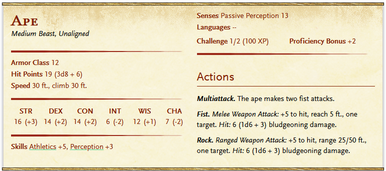

# utility

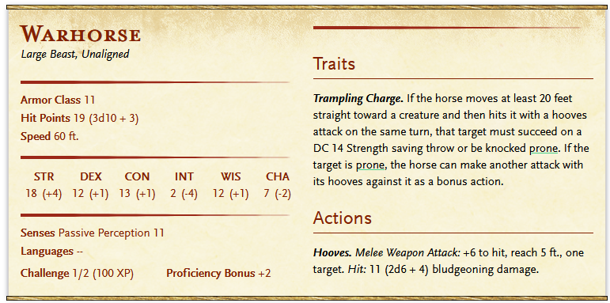

